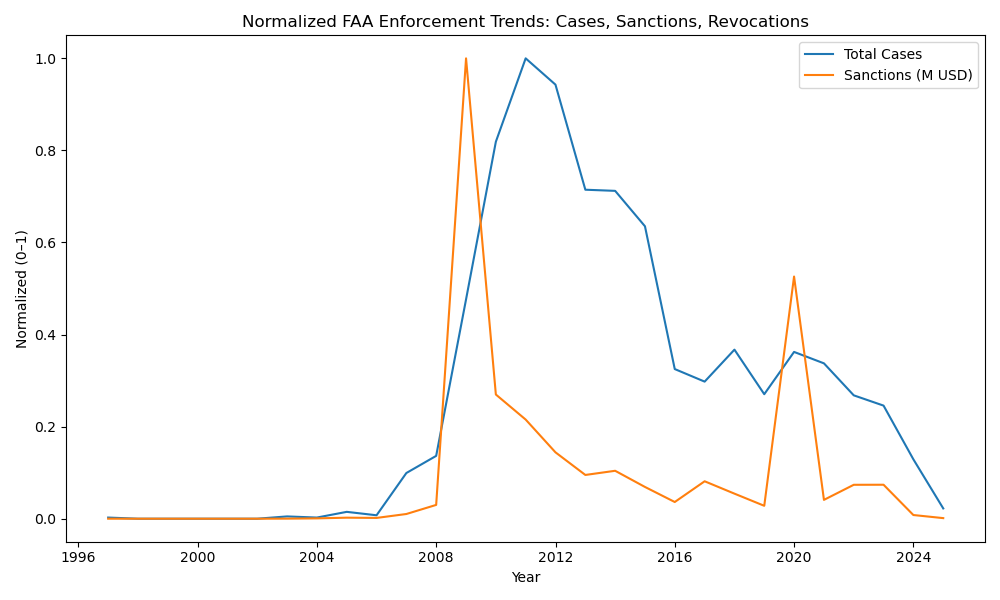
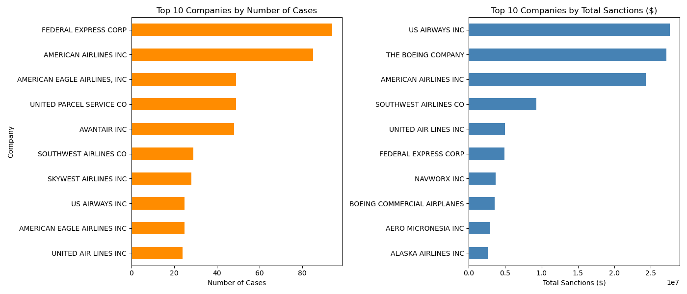
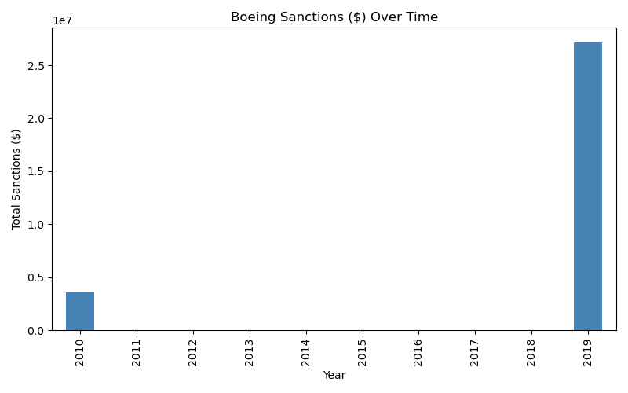

# FAA Enforcement Monitoring System

## Overview
The **FAA Enforcement Monitoring System** is a data engineering and analytics project designed to process and analyze **Federal Aviation Administration (FAA) enforcement action records**.  
The **current goal** is to build a robust **ELT (Extract, Load, Transform) pipeline** for data ingestion, cleaning, and publishing.  
The **stretch goal** is to implement a **real-time monitoring dashboard** with predictive analytics to identify potential safety and compliance risks.  

## Data Source
The datasets used in this project are sourced from the **Federal Aviation Administration (FAA) Enforcement Information System**.
You can access the raw enforcement data here:  
🔗 [FAA Enforcement Actions Reports](https://www.faa.gov/about/office_org/headquarters_offices/agc/practice_areas/enforcement/reports)

---

## Features

### Current Capabilities
- **Automated ELT Pipeline**  
  - Extracts raw FAA enforcement reports from multiple formats (PDF, XLSX, CSV).  
  - Cleans, standardizes, and merges data into a unified schema.  
  - Outputs **publish-ready datasets** in CSV/XLSX for downstream use.  

- **Exploratory Data Analysis (EDA)**  
  - Performed in Jupyter Notebooks (`analysis for cleaning.ipynb`, `faa_enforcement_analysis.ipynb`).  
  - Trend analysis by year, violation type, and enforcement action.  
  - Data quality validation and governance compliance.  

- **Data Publishing**  
  - Final cleaned datasets (`faa_enforcement_final_cleaned.csv`) are documented and stored for reproducibility.  
  - Supports integration with BI tools (Power BI, Tableau).  

---

### Planned Enhancements (Stretch Goals)  
- **Interactive Dashboard**  
  - Build with Power BI / Tableau / Plotly Dash for dynamic filtering and visualization.  

- **Predictive Analytics**  
  - Implement ML models to forecast potential safety/compliance risks.  

- **Automated Cloud Deployment**  
  - Host ETL on AWS with scheduled refresh and CI/CD integration.  

---

## Repository Structure
```
FAA_ENFORCEMENT_MONITORING_SYSTEM/
│
├── dashboards/                     # Future BI dashboard files
├── data/
│   ├── processed/                   # Cleaned & merged datasets
│   ├── raw/                         # Original FAA datasets
│
├── FAA_Quarterly_Reports/           # Source enforcement reports
├── notebooks/                       # Jupyter analysis workflows
│   ├── analysis for cleaning.ipynb
│   └── faa_enforcement_analysis.ipynb
│
├── scripts/
│   ├── elt/                         # ETL pipeline scripts
│   │   ├── clean/
│   │   │   └── clean_faa_enforcement_data.py
│   │   └── extract/
│   │       ├── pdf_parser.py
│   │       ├── record_extractor.py
│   │       └── ...
│
├── README.md                        # Project documentation
├── requirements.txt                 # Dependencies
└── venv/                             # Virtual environment
```

---

## Installation & Usage

### **1. Clone Repository**
```bash
git clone https://github.com/<your-username>/FAA_Enforcement_Monitoring_System.git
cd FAA_Enforcement_Monitoring_System
```

### **2. Create Virtual Environment**
```bash
python -m venv venv
source venv/bin/activate   # Mac/Linux
venv\Scripts\activate    # Windows
```

### **3. Install Dependencies**
```bash
pip install -r requirements.txt
```

### **4. Run ETL Pipeline**
```bash
python scripts/elt/elt.py
```

### **5. Explore Analysis**
```bash
jupyter notebook
```
Open the notebooks in the `notebooks/` folder.

---

## Example Output
Example snippet from processed dataset (`faa_enforcement_final_cleaned.csv`):  

| CASE_NUMBER  | ENTITY_NAME                      | ACTION               | SANCTION_AMOUNT | CURRENCY | CASE_TYPE      | CLOSED_DATE |
|--------------|----------------------------------|----------------------|-----------------|----------|----------------|-------------|
| 2008GL170135 | CRUCIAL AIR SUPPORT LLC          | ASSESS CIVIL PENALTY | 1000.0          | DOLLARS  | MAINTENANCE    | 2010-01-04  |
| 2007WP190187 | PRIMARIS AIRLINES INC            | ASSESS CIVIL PENALTY |                 |          | RECORDS/RPTS   | 2010-01-04  |
| 2006WP170451 | MESA AIRLINES INC                | ASSESS CIVIL PENALTY | 55000.0         | DOLLARS  | HAZ MAT        | 2010-01-05  |
| 2009WP530068 | HAWAIIAN AIRLINES INC            | ASSESS CIVIL PENALTY | 14000.0         | DOLLARS  | FLT OPNS       | 2010-01-08  |

## Analysis Highlights

### Industry-Wide Trends

Enforcement activity shows industry-level spikes and declines:
- Cases, sanctions, and revocations peaked around **2010–2012**.  
- A secondary spike in **2020** sanctions occurred despite fewer cases, likely tied to **COVID-19 disruptions**.  

---

### Company Comparisons

Case frequency and financial impact differ widely by company:
- **FedEx** and **American Airlines** dominate by number of cases.  
- **Boeing**, despite fewer cases, ranks **#2 in total sanctions ($)** — indicating fewer but costlier penalties.  

---

### Boeing Case Study

Boeing’s sanctions are concentrated in only two years:
- **2010:** Two civil penalties totaling **$3.5M**.  
- **2019:** Multiple entries consolidated into two cases, one of which involved a quality-control penalty of $27M. 

---

## Tech Stack
- Python (pandas, matplotlib, seaborn) for data wrangling and visualization  
- Jupyter Notebook for exploration and reproducibility  
- GitHub for version control and reporting  

---

## Next Steps
- Expand peer-company comparisons with more granular case types.  
- Analyze sanction categories (civil penalties vs. revocations).  
- Build a lightweight dashboard for interactive exploration.
---

## Tech Stack
- **Languages:** Python (Pandas, NumPy, PyPDF2)  
- **Tools:** Jupyter Notebook, Power BI / Tableau (planned)  
- **Data Engineering:** ETL Pipelines, Data Cleaning, Data Standardization  
- **Cloud (Stretch Goal):** AWS Lambda, S3, CloudWatch, CI/CD  

## License
This project is released under the [MIT License](LICENSE).